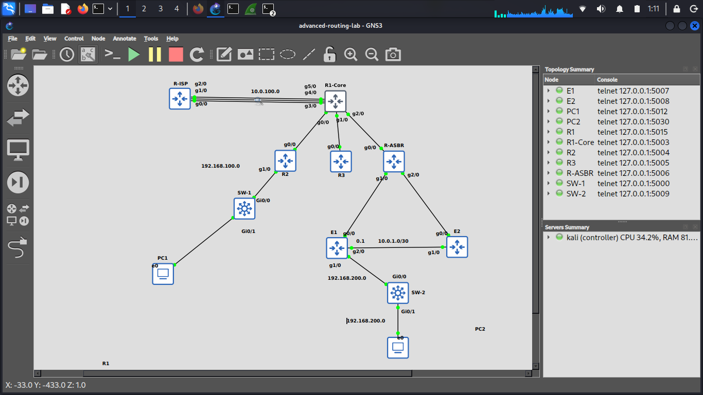

# Enterprise Multi-Protocol Routing Lab

🔬 **Project 4 — CCNP Level | Advanced Routing**

Implementation of advanced routing in an Enterprise topology including OSPF Multi-Area, EIGRP, Route Redistribution, and Route Filtering.

---

## 📋 Overview 

This project is a comprehensive CCNP-level routing lab where the following concepts are implemented hands-on:

- **OSPF Multi-Area** with Route Summarization
- **EIGRP** with DUAL and Variance (Load Balancing)
- **Route Redistribution** between OSPF and EIGRP
- **Route Filtering** with Prefix-list and Route-map

---

## 🏗️ Topology



### Topology Components:
- **6 Cisco 7200 Routers:** R1-Core, R2, R3, R-ASBR, E1, E2
- **2 vios_l2 Switches:** SW-1, SW-2
- **2 VPCS Clients:** PC1, PC2

---

## 📊 IP Addressing

| Device | Interface | IP Address | Description |
|--------|-----------|------------|-------------|
| R1-Core | Gi0/0 | 10.0.0.1/30 | Link to R2 |
| R1-Core | Gi1/0 | 10.0.0.5/30 | Link to R3 |
| R1-Core | Gi2/0 | 10.0.0.9/30 | Link to R-ASBR |
| R1-Core | Lo0 | 1.1.1.1/32 | Router-ID |
| R2 | Gi0/0 | 10.0.0.2/30 | Link to R1-Core |
| R2 | Gi1/0 | 192.168.100.1/24 | LAN (PC1 Gateway) |
| R2 | Lo0 | 2.2.2.2/32 | Router-ID |
| R2 | Lo10 | 172.16.1.1/24 | Test Summarization |
| R2 | Lo11 | 172.16.2.1/24 | Test Summarization |
| R3 | Gi0/0 | 10.0.0.6/30 | Link to R1-Core |
| R3 | Lo0 | 3.3.3.3/32 | Router-ID |
| R3 | Lo10 | 172.17.1.1/24 | Test Summarization |
| R3 | Lo11 | 172.17.2.1/24 | Test Summarization |
| R-ASBR | Gi0/0 | 10.0.0.10/30 | Link to R1-Core |
| R-ASBR | Gi1/0 | 10.0.0.13/30 | Link to E1 |
| R-ASBR | Gi2/0 | 10.0.0.17/30 | Link to E2 |
| R-ASBR | Lo0 | 4.4.4.4/32 | Router-ID |
| E1 | Gi0/0 | 10.0.0.14/30 | Link to R-ASBR |
| E1 | Gi1/0 | 192.168.200.1/24 | LAN (PC2 Gateway) |
| E1 | Lo0 | 5.5.5.5/32 | Router-ID |
| E2 | Gi0/0 | 10.0.0.18/30 | Link to R-ASBR |
| E2 | Lo0 | 6.6.6.6/32 | Router-ID |
| PC1 | e0 | 192.168.100.10/24 | Gateway: 192.168.100.1 |
| PC2 | e0 | 192.168.200.10/24 | Gateway: 192.168.200.1 |

---

## 🎯 Design Overview

### OSPF Areas
| Router | Role | Areas |
|--------|------|-------|
| **R1-Core** | **ABR** | 0, 1, 2 |
| **R2** | Internal Router | 1 |
| **R3** | Internal Router | 2 |
| **R-ASBR** | Internal Router | 0 |

### EIGRP Domain
- **E1, E2** — EIGRP AS 10
- **R-ASBR** — Border point between OSPF and EIGRP (ASBR)

---

## ✅ Progress

- [x] **Phase 1: OSPF Multi-Area + Summarization**
- [x] Phase 2: EIGRP + DUAL + Variance
- [x] Phase 3: Route Redistribution (OSPF ↔ EIGRP)
- [x] Phase 4: Route Filtering (Prefix-list + Route-map)

---

## 📊 Phase 1: OSPF Multi-Area

### 🔧 Configuration Highlights

- Enabled OSPF Process 1 on all routers with manually configured Router-IDs
- **R1-Core** acts as ABR between three areas (0, 1, 2)
- **Route Summarization** with /22 on R1-Core:
  ```
  area 1 range 172.16.0.0 255.255.252.0
  area 2 range 172.17.0.0 255.255.252.0
  ```
- Added Loopback10 and Loopback11 on R2 and R3 for Summarization testing

### ✅ Verification Results

- ✅ **3 OSPF neighbors FULL** on R1-Core (R2, R3, R-ASBR)
- ✅ **1 OSPF neighbor FULL** on every other router
- ✅ Intra-area and Inter-area route lists working correctly
- ✅ Summary routes (`172.16.0.0/22`, `172.17.0.0/22`) visible in LSDB
- ✅ End-to-end ping tests — **100% success rate**

### 🐛 Issues Encountered & Solutions

**Issue #1: Loopback0 not advertised in OSPF**

- **Problem:** Pings with `source loopback 0` were failing between routers
- **Root Cause:** Loopback0 was not advertised via the `network` command
- **Solution:** Added `network X.X.X.X 0.0.0.0 area Y` on R2, R3, and R-ASBR
- **Lesson Learned:** In OSPF, every interface must be **explicitly** advertised using the `network` command — unlike EIGRP which uses class-based advertisement.

---


## 📊 Phase 2: EIGRP + DUAL

### 🔧 Configuration Highlights

- Enabled EIGRP AS 10 on R-ASBR, E1, E2
- Added secondary link between E1 and E2 (`10.0.1.0/30`)
- Disabled `auto-summary` on all EIGRP routers
- Advertised Loopbacks and LAN subnets (`192.168.200.0/24`)
- Configured `passive-interface` on Loopback and LAN-facing interfaces

### ✅ Verification Results

- ✅ 2 EIGRP neighbors on each router (R-ASBR, E1, E2)
- ✅ DUAL Topology Table analyzed with `all-links`
- ✅ ECMP active on `10.0.0.16/30` and `10.0.0.12/30`
- ✅ `192.168.200.0/24` propagated from E1 to E2

### 🐛 Issues Encountered & Solutions

**Issue #1: Wrong IP on E2's Gi1/0**
- **Problem:** Pings between E1 and E2 took the indirect path via R-ASBR
- **Root Cause:** IP `10.0.0.2/30` mistakenly configured on E2's Gi1/0 (conflict with R2)
- **## 📊 Phase 3: Route Redistribution (OSPF ↔ EIGRP)

### 🎯 Goal

Bridge the two routing domains (OSPF and EIGRP) so that routes from each domain become visible in the other, enabling end-to-end connectivity between PC1 (OSPF side) and PC2 (EIGRP side).

### 🔧 Configuration Highlights

**R-ASBR** acts as the **ASBR (Autonomous System Boundary Router)** — the meeting point between OSPF and EIGRP.

#### Redistribution EIGRP → OSPF

Configured inside `router ospf 1`:

```
router ospf 1
 router-id 4.4.4.4
 redistribute eigrp 10 subnets metric-type 1 metric 100
 passive-interface Loopback0
 network 4.4.4.4 0.0.0.0 area 0
 network 10.0.0.8 0.0.0.3 area 0
```

| Keyword | Purpose |
|---------|---------|
| `redistribute eigrp 10` | Import routes from EIGRP AS 10 |
| `subnets` | **Critical** — includes subnetted routes (`/30`, `/32`) |
| `metric-type 1` | E1 = Seed metric + internal OSPF cost (dynamic) |
| `metric 100` | Seed metric for external routes |

#### Redistribution OSPF → EIGRP

Configured inside `router eigrp 10`:

```
router eigrp 10
 network 4.4.4.4 0.0.0.0
 network 10.0.0.12 0.0.0.3
 network 10.0.0.16 0.0.0.3
 redistribute ospf 1 metric 10000 100 255 1 1500
 passive-interface Loopback0
 passive-interface GigabitEthernet0/0
```

| Parameter | Value | Meaning |
|-----------|:-----:|---------|
| Bandwidth | `10000` | Kbps |
| Delay | `100` | Tens of microseconds |
| Reliability | `255` | 100% |
| Load | `1` | Minimum load |
| MTU | `1500` | Bytes |

> ⚠️ **Note:** All 5 metric parameters are mandatory for EIGRP redistribution. Without them, routes are treated with infinite metric and never installed.

### ✅ Verification Results

#### On R2 (OSPF side) — EIGRP routes appear as `O E1`:

```
O E1  5.5.5.5/32        [110/102] via 10.0.0.1
O E1  6.6.6.6/32        [110/102] via 10.0.0.1
O E1  10.0.0.12/30      [110/102] via 10.0.0.1
O E1  10.0.0.16/30      [110/102] via 10.0.0.1
O E1  10.0.1.0/30       [110/102] via 10.0.0.1
O E1  192.168.200.0/24  [110/102] via 10.0.0.1
```

**Metric calculation confirmed:** `Seed (100) + Internal OSPF (2) = 102` → `metric-type 1` working correctly ✅

#### On E1/E2 (EIGRP side) — OSPF routes appear as `D EX`:

```
D EX  1.1.1.1/32        [170/281856] via 10.0.0.13
D EX  2.2.2.2/32        [170/281856] via 10.0.0.13
D EX  3.3.3.3/32        [170/281856] via 10.0.0.13
D EX  10.0.0.0/30       [170/281856] via 10.0.0.13
D EX  10.0.0.4/30       [170/281856] via 10.0.0.13
D EX  10.0.0.8/30       [170/281856] via 10.0.0.13
D EX  172.16.0.0/22     [170/281856] via 10.0.0.13
D EX  172.17.0.0/22     [170/281856] via 10.0.0.13
D EX  192.168.100.0/24  [170/281856] via 10.0.0.13
```

**Administrative Distance confirmed:** External EIGRP routes have AD = `170` (vs. internal = `90`) ✅

#### End-to-End Connectivity 🎉

```
PC1> ping 192.168.200.10
84 bytes from 192.168.200.10 icmp_seq=1 ttl=60 time=251.037 ms
84 bytes from 192.168.200.10 icmp_seq=2 ttl=60 time=189.277 ms
84 bytes from 192.168.200.10 icmp_seq=3 ttl=60 time=139.511 ms
84 bytes from 192.168.200.10 icmp_seq=4 ttl=60 time=198.125 ms
84 bytes from 192.168.200.10 icmp_seq=5 ttl=60 time=168.369 ms
```

**Full bidirectional connectivity across the OSPF/EIGRP boundary!** ✅

### 🧠 Key Concepts Learned

| Concept | Description |
|---------|-------------|
| **Seed Metric** | Artificial metric assigned to redistributed routes so the destination protocol can understand them |
| **`subnets` keyword** | Required for OSPF redistribution — without it, only classful routes are advertised |
| **E1 vs E2** | E1 = Seed + internal OSPF cost (dynamic); E2 = Seed only (Cisco default) |
| **Route Preference** | Internal EIGRP (AD 90) wins over External EIGRP (AD 170) |
| **Direction Rule** | Redistribution command goes inside the **destination** protocol |

### 🐛 Issues Encountered & Solutions

**Issue #1: All External Routes Share the Same Metric**

- **Observation:** Every redistributed OSPF route into EIGRP showed the identical metric `281856`
- **Reason:** Redistribution assigns the same Seed Metric (`10000 100 255 1 1500`) to all routes
- **Impact:** EIGRP cannot differentiate between closer and farther external networks based on metric alone
- **Solution (Phase 4):** Use a Route-map to assign varying metrics per prefix
- **Lesson:** Seed Metric is a one-size-fits-all value; granular control requires Route-maps

**Issue #2: `subnets` Keyword Not Visible in `show run`**

- **Observation:** After `redistribute eigrp 10 subnets metric-type 1 metric 100`, the `subnets` keyword didn't appear in `show running-config`
- **Reason:** Some IOS versions treat `subnets` as default behavior in this context
- **Verification:** Confirmed working by checking that `/30` and `/32` routes appear as `O E1`
- **Lesson:** Trust the routing table, not just the config outputSolution:** Corrected to `10.0.1.2/30`
- **Lesson Learned:** Always verify subnet consistency between directly-connected interfaces.

**Issue #2: `192.168.200.0/24` not advertised**
- **Problem:** E2 couldn't learn E1's LAN subnet
- **Root Cause:** Gi1/0 on E1 had no IP configured
- **Solution:** Assigned `192.168.200.1/24` to Gi1/0
- **Lesson Learned:** EIGRP `network` only advertises interfaces that are up with an assigned IP.


## 📊 Phase 4: Route Filtering

### 🔧 Configuration Highlights

- Created **Prefix-list** `Filter-172.17` to match `172.17.0.0/22`
- Created **Route-map** `RM-OSPF-TO-EIGRP` with two sequences:
  - `seq 10 deny`: Matches Prefix-list → Denies
  - `seq 20 permit`: Catches all remaining routes
- Applied Route-map on EIGRP Redistribution: `redistribute ospf 1 metric 10000 100 255 1 1500 route-map RM-OSPF-TO-EIGRP`

### ✅ Verification Results

- ✅ `172.17.0.0/22` **no longer appears** in E1/E2 routing tables
- ✅ `172.16.0.0/22` and other routes still propagate normally
- ✅ **R2 still sees `172.17.0.0/22`** (filter only applies to OSPF→EIGRP)
- ✅ E2E connectivity intact

### 🧠 Key Concepts Learned

- **Prefix-list inside Route-map:** `permit` = "match", `deny` = "no match"
  (counterintuitive, but this is how IOS interprets it!)
- **Deleting Prefix-list entries:** Must use `no ip prefix-list <NAME> seq <N>`
  (without `permit`/`deny`/network)
- **Implicit Deny in Prefix-list:** Last entry is always deny
- **Route-map Sequence:** Lower sequence number = checked first
- **Direction of Redistribution:** Command inside the **destination** protocol

### 🐛 Issues Encountered & Solutions

**Issue #1: Applied Route-map to wrong direction**
- **Problem:** Filter wasn't working; `172.17.0.0/22` still visible on E1
- **Root Cause:** Route-map was applied to `router ospf 1` (EIGRP→OSPF) instead of `router eigrp 10` (OSPF→EIGRP)
- **Solution:** Moved Route-map to `router eigrp 10`
- **Lesson:** Redistribution command goes inside the **destination** protocol

**Issue #2: Prefix-list `deny` instead of `permit`**
- **Problem:** Filter wasn't matching correctly
- **Root Cause:** In Route-map context, Prefix-list `deny` means "no match"
- **Solution:** Changed prefix-list to `permit 172.17.0.0/22`
- **Lesson:** Match criteria in Route-map follows permit/deny interpretation

**Issue #3: Removing individual Prefix-list entries**
- **Problem:** `no ip prefix-list <name> seq 8 permit ...` failed
- **Solution:** Use only `no ip prefix-list <name> seq <N>` (without keywords)
- **Lesson:** IOS matches entries by sequence number only

## 📂 Repository Structure

```
advanced-routing-lab/
├── README.md
├── topology/
│   └── topology.png                    # GNS3 topology screenshot
├── verification/                        # Command output verification
│   ├── phase1-ospf-neighbors.txt
│   ├── phase1-ospf-interface.txt
│   ├── phase1-ospf-database.txt
│   ├── phase1-ospf-summarization.txt
│   └── phase1-ospf-ping-tests.txt
└── configs/                             # (Coming soon — final router configs)
```

---

## 🛠️ Environment

| Component | Detail |
|-----------|--------|
| **Hypervisor** | GNS3 on Kali Linux |
| **Router Image** | c7200-adventerprisek9 |
| **Switch Image** | vios_l2-adventerprisek9 |
| **Editor** | VS Code Web (vscode.dev) |
| **Version Control** | GitHub |
